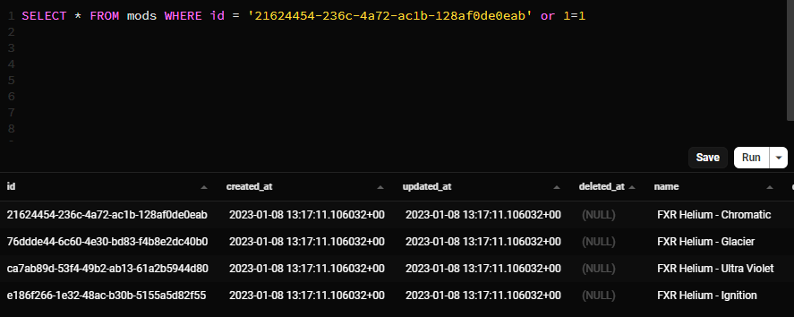
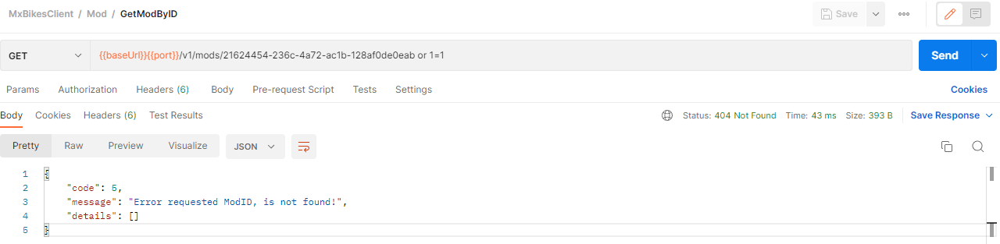
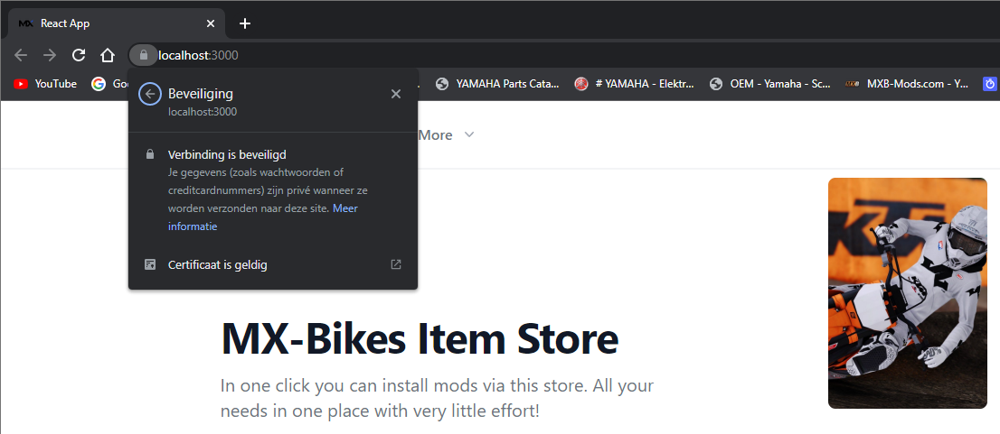
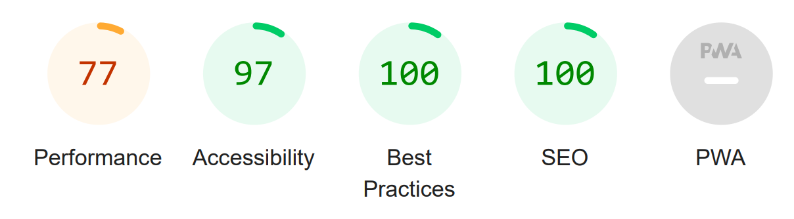
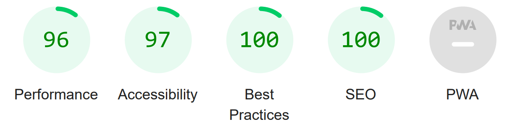
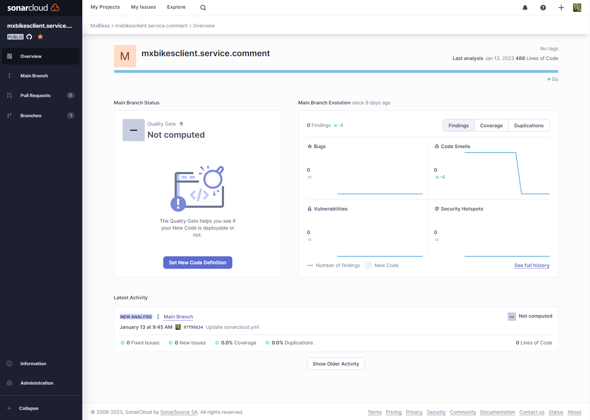
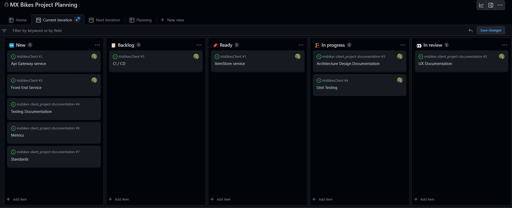
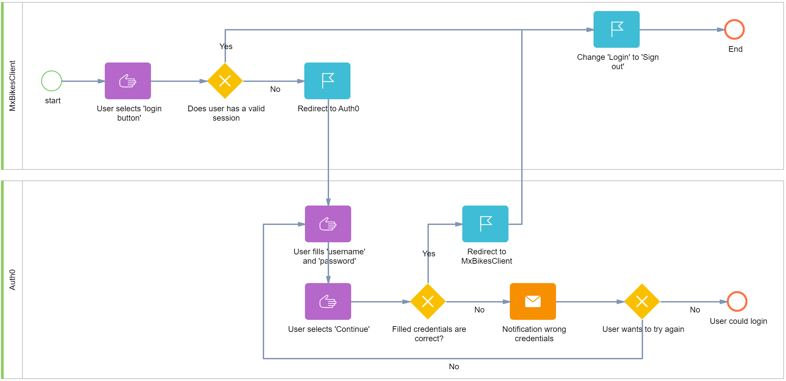
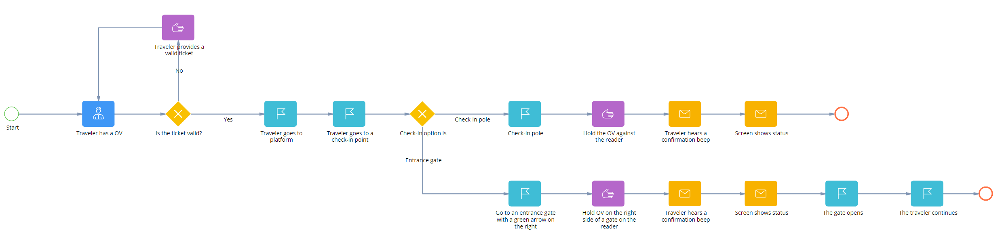

# fontys_s3_portfolio

Fontys semster 3 portfolio of the associate degree, ICT &amp; Software Engineering

-   Created By: Rik van Haaren
-   Hans van Heumen, Mark van Grootel

# Table of contents

-   [1. Introduction]()
-   [2. Learning Outcomes]()
    -   [2.1 Web application]()
    -   [2.2 Software quality]()
    -   [2.3 Agile method]()
    -   [2.4 CI/CD]()
    -   [2.5 Cultural differences and ethics]()
    -   [2.6 Requirements and design]()
    -   [2.7 Business processes]()
    -   [2.8 Professional]()
-   [3. Decision justification]()
-   [4. Individual Project (MxBikesClient)]()
-   [5. Group Project (IsItLive)]()
-   [6. Reflection]()

# 1. Introduction

**|DONE|<br>**
Front-end, Back-end, Microservices, Docker all of these words have one thing in common, it’s used when designing and building a full stack application. With this portfolio I would like to explain how I applied all learning outcomes within my individual and group project. For the individual project I designed and build a web shop for downloading content specifically for the game MX Bikes. Within the group project we designed and build a live score metric for World of Content. With these products and this portfolio I show that I have sufficient knowledge and competences to begin with my internship within the next semester. Since the learning outcomes are the foundation for this portfolio, they will directly be discussed in the next chapter. In the following chapters, chapter three and four, the individual and group projects will be explained. Finally, within the last chapter the reflection is provided.

# 2. Learning Outcomes

This chapter provides insight within the [learning outcomes](/learningOutcomes.md#3-Agile-method). Every paragraph shortly indicates what the outcome means and explains how the specific outcome is achieved. Sometimes there is redirection for further information.

## 2.1 Web application

This learning outcome is about whether the design and build is **user-friendly** and a **full-stack** web application.

### 2.1.1 User-friendly <br/>

**|DONE|<br>**
_Individual project_<br/>
To ensure the user friendliness there a several measurements taken. First, I created a user persona based on interviews with two people that actually play the game. Based on that persona I created User Scenario's, these describe several scenarios and actions applicable to the persona. These User Scenario's are used to create user stories, which are used as a base for the design of the full stack application. Finally, there was a informal check with the interviewees. All these steps are extensively defined within [this file](./mxBikesClient_documentation/uxDocumentation.md).

_Group project_<br/>
In order to make sure the full stack application is user friendly, first the requirements (included in [this](./isItLive_documentation/requirements.md) paragraph) were aligned with World of Content. Based on these requirements we designed a wire frame with the project group. The design was checked with World of Content. The aspect of user-friendliness is also taken into account within this check, since the retailers are the customers of World of content and are the users of the product.

2.1.2 Full-stack<br/>
_Individual project_<br/>
The individual project is designed and build based on a full stack application, since I designed and build a separate back- and front-end. The front-end is developed as a single page application, with the framework React (a Javascript based framework). The back-end which is developed with multiple micro services, insight this microservice you can find multiple commonly used techniques like Object Relational Mapping. For the communication protocol I use http. To address asynchronous communication issues, several tests are executed to prevent issues from occurring. Also, the deployment environment wil restart when a process is offline and all issues will be logged.

_Group project_<br/>
Also, the group project is designed and build based on a full stack application. Mostly of the previous mentioned explanations are also applicable to the group project. Except that the backend is developed with NodeJS and not with microservices. You can access the frontend with this link.

<hr/>

## 2.2 Software quality
To ensure the quality of my application, several points are taken into account: tests, security, performance, and Static Code Analysis / Code Reviews. In the paragraphs below you can find how these aspects contribute to the quality of the application.

### 2.2.1 Tests <br/>
I conducted several tests within the application in order to ensure the quality, since it's easy to detect errors or issues by doing tests. When the tests are conducted, I am able to solve these issues and errors as soon as possible so the impact on the application is minimalized. Snippets of several tests you can find below.  

**Unit Test**
With a Unit Test, software modules will be tested separately. So, more tests will be developed for each unit. In an ideal state all test cases are independent of other test. This is a way of testing which is fast and thoroughly, and which is easy to implement. In the example below you can find a unit test of the functionality of the handler. “GetCommentByModID”, where I test whether the input has a valid UUID (which corresponds to the format).  When the situation appears that the UUID is wrong, the test should give an error message. 

*Snippet of Test* <br>
```golang
func TestIsValidNotExpired(t *testing.T) {
	// Arrange
	var expiresAt = time.Now().Local().Add(time.Hour * time.Duration(2))

	// Act
	isValid := IsValid(models.AuthResponse{ExpiresAt: expiresAt})

	// Assert
	assert.Equal(t, isValid, true)
}

func TestIsValidExpired(t *testing.T) {
	// Arrange
	var expiresAt = time.Date(2021, 8, 15, 14, 30, 45, 100, time.Local)

	// Act
	isValid := IsValid(models.AuthResponse{ExpiresAt: expiresAt})

	// Assert
	assert.Equal(t, isValid, false)
}
```

**Integration test**
The next conducted test is an integration test, where individual software modules will be connected and tested as a whole. So, with this test we ensure the different modules actually work together. In the example below, the test checks whether two units (handler and repository) work together correctly, by verifying that if a correct request is sent to the handler "GetCommentByID" the expected result will come back. The expected result of this function means in this case that the requested modID is retrieved from the database without an error message.

*Snippet of Test* <br>
```golang
// will test update comment
func TestGetCommentByModID(t *testing.T) {
	// Arrange
	var modID = uuid.New()

	db, mock := NewMock()
	mock.ExpectQuery(regexp.QuoteMeta(`SELECT * FROM "comments" WHERE mod_id = $1 AND "comments"."deleted_at" IS NULL`)).
		WithArgs(modID).
		WillReturnRows(sqlmock.
			NewRows([]string{"ID", "ModID", "UserID", "Text"}).
			AddRow(uuid.New().String(), modID.String(), uuid.New().String(), "Good Job!"))

	gdb, err := gorm.Open(postgres.New(postgres.Config{Conn: db}), &gorm.Config{})
	if err != nil {
		log.Fatalf(log_failedConn, err)
	}

	repo := repository.NewRepository(gdb)
	handler := New(repo, *logrus.New())

	// Act
	result, err := handler.GetCommentByModID(context.Background(), &protobuffer.GetCommentByModIDRequest{ModID: modID.String()})

	// Assert
	assert.NoError(t, err)
	assert.Equal(t, result.Comments[0].ModID, modID.String())
}
```

**Regression**
Finally, regression testing is a method that ensures the application is still working as expected after any code changes, updates or improvements. With this test the overall stability and functionality of the existing features of the application is secured. This is part of the System Test. The regression is tested in GitHub, by conducting all unit and integration tests at the moment a change takes place. I also perform tests in Postman, where

I am able to test the entire back end with all functionalities, including the speed of the application. Below you can find a snippet where the 'User' collection is tested on speed and whether the input gives the expected results.

*Snippet of Test* <br>
```javascript
const correctUserID = "auth0|63b2dff9e834e550f0e50e66"
const unkownUserID = "auth0|123456789123456789123456"
const userEndpoint = `${pm.variables.get("baseUrl")}${pm.variables.get("port")}/v1/users`;

pm.test("Response time is less than 500ms", function () {
    pm.expect(pm.response.responseTime).to.be.below(500);
});

pm.test("Assure that correct UserID get users", function () {
    pm.sendRequest(`${userEndpoint}/${correctUserID}`, function (err, response) {
        var jsonData = response.json();
        pm.expect(200).to.eql(response.code);
        pm.expect(jsonData.User.ID).to.eql(pm.globals.get("userID"));
    });
});

pm.test("Assure that empty UserID status 500", function () {
    pm.sendRequest(`${userEndpoint}/`, function (err, response) {
        pm.expect(500).to.eql(response.code);

    });
});

pm.test("Assure that unkown UserID status 500", function () {
    pm.sendRequest(`${userEndpoint}/${unkownUserID}`, function (err, response) {
        pm.expect(500).to.eql(response.code);
    });
});
```

### 2.2.2 Security <br/>
To ensure security, several measurements are taken. My full stack application is tested on common vulnerabilities by a tool called "OWASP ZAP". This tool created a report which showed the vulnerability risks. I checked whether these risks where no big security risks. Since, this wasn't the case I am able to conclude the application functions in a safe way.

I also used SonarCloud to check if there are any security vulnerabilities like connection strings or passwords in my code. Some issues appeared. In example, that there was a connection string and also that I had some duplicated codes. I solved all of the issues that appeared.

Based on my experience, I am also familiar with the common vulnerability ''SQL injection''. Beforhand, I took some measurements to make sure this vulnerability was covered, by using a package named "GORM" that resolves the issue by: "argument placeholders to construct the SQL statement". I also tested this with Postman to assure that it works correctly.

*without protection*


*with protection*


The front-end has a self-signed ssl certificate for establishing an encrypted link between the server and a client. This....

 

### 2.2.3 Performance <br/>
In order to test the performance of the application I used two tools named: Postman and Lighthouse, both explained below.

With Postman I conducted a test which showed how long it takes to receive a response directly from the Rest-API or a gRPC server. Finally with these results, I was able to conclude the response time was below 200 ms.

```javascript
pm.test("Response time is less than 200ms", function () {

    pm.expect(pm.response.responseTime).to.be.below(200);

});
```
 
With the tool Lighthouse, I get a report of how the SPA (Single Page Application) performs. This performance report (with back end and frond end) should be checked with the non-functional requirement to have a response time under 2 seconds. The report shows the page takes 0.9 seconds to be fully interactive. So, this requirement is met.

I also noticed that the performance score of the report was 77/100 (orange). I did some research to see how this specific score could be improved. I was able to compress the images to a lower quality, which benefits the loading speed of the application. Finally, I realized that running the test in an 'Incognito mode' improved the performance score, since the extensions on my own Chrome profile caused some blocking time. With these changes the performance score is much more improved.


[Lighthouse Report original](./utils/lighthouse_rapport/lighthouse_report-homepage.pdf)


[Lighthouse Report after fixes](./utils/lighthouse_rapport/lighthouse_report-homepage_fixed.pdf)

 

### 2.2.4 Static Code Analysis / code reviews
Static Code Analysis is the process of detecting bad coding style, potential vulnerabilities, and security flaws in a software's source code without actually running it. I used a tool named SolarCloud, to run an analysis. This provides an overview of the current quality of a repository, in which I can see results on "Reliability", "Maintainability", "Security", "Security Review" and "Duplications". I also added this as a continuous integration, so that GitHub shows whether the code meets the requirements.



## 2.3 Agile method
**|DONE|<br>**
_Individual project_
During this semester we worked based on an Agile method in both, the group- and the individual project. Since there are several methods to work with Agile, I did some research to find out which method fits best for the project. You can read more about this analysis inside [this file](./research/agile.md).

Kanban is a framework used to develop Agile. Within the individual project I choose to work with 'Kanban', because this methodology is easy to apply with a version control tool called GitHub. This allowed me to constantly sync issues to a Kanban board, in a way that the issue history still exists and are always up to date and is the same for everbody. < Working this way contributes to the principles of Agile to work with an adaptive planning, with evolutionary development, which enables early delivery and flexible responses to changes. In example, you can see one of the used sprints below.



Besides, on weekly basis there was a group discussion where we discussed the current progress with Hans van Heumen and the fellow students. Some of the feedback was converted in an issue which influenced and changed the Kanban board. In this way, also the collaborative effort and self-organizing principle are represented, and continual improvement is made possible.
 

_Group project_
For our group project we opted for the 'Scrum' Agile method. We held a stand-up every day where we met to see how the designated tasks were going. This is typical for Scrum methods. These daily stand-ups allowed us to help each other and to discuss any feedback.  Just as the individual project, we had our issue overview linked to the Kanban board in 'Github', in this way we could see the progress of each other and were able to make sure everybody was engaged. Looking at Agile, this contributes to self-organizing and cross-functional teams, where continual improvement was guiding.

What also contributed to the continual improvement was that we frequently visited the customer to make sure we were working on the right needs. In order to be flexible in responding to these changes we worked with sprints, including evolutionary development and early delivery.

## 2.4 CI/CD
**|NeedsCheck|<br>**
what?
Inside the Github repositories I added Continuous Integration and Continuous Delivery via actions. I used this inside the group project and the individual project. Below you can see the integration I used for the repositories. 

Continuous Integration
- A push and pull request to the main branch will trigger a build that compiles the code into an executable, after that it will test the code on Go version '1.19'. [Link to Action](https://github.com/mxbikes/mxbikesclient.service.comment/actions/workflows/go.yml)
- A push and pull request to the main branch will trigger a SonarCloud analyzer that validates the code on ‘Static code analysis / code reviews’ and ‘Security’. [Link to Actionaction](https://github.com/mxbikes/mxbikesclient.service.comment/blob/main/.github/workflows/sonarcloud.yml)
- A push and pull request to the main branche will trigger the tests that checks the application in Node version: '14.x', '16.x', '18.x'. [workflows CI](https://github.com/RikVanHaaren/ah_shop_api/actions/workflows/node.js.yml)

Continuous Delivery

- A push to the main branch will test and then publish the project on "hub.docker". [service-comment image](https://hub.docker.com/repository/docker/rikvanhaaren/service-comment/general)
- The go project will regularly add or update the project to pkg.go.dev. [golang package protobuf](https://pkg.go.dev/github.com/mxbikes/protobuf)
- A new release will trigger the tests and will then publish the release on [NPM ah_shop_api](https://www.npmjs.com/package/@rikvanhaaren/ah_shop_api).


so what?
This will assure the quality and security of my repository. Whenever someone makes a mistake and it gets on the repository which ends, I will be notified via email and all the users that visit the repository sees that it failed at the moment. Because it continues it also shortens the time and effort to deliver new features.

now what?
Now I can assure the quality of my project and test if the project meets certain requirements and it will shorten the time to deploy new features.


## 2.5 Cultural differences and ethics
```
[OUD]
*Tijdens dit semester heb ik onderzoek gedaan naar de cultural differences and ethics. Omdat ik me nog niet bewust genoeg was van deze termen heb ik onderzoek gedaan naar wat het precies inhield. Hierdoor kwam ik in aanraking met verschillende ethische aspecten in software engineering en heb ik deze op basis van de theorie onderbouwd.

Hiernaar heb ik deze aspecten toegepast in het groepsproject hoe wij als verschillende ontwikkelaars samenwerken.

Tot slot kwam ik de ‘Code of Ethics and Professional Conduct’ waarvan ik 1 guideline heb uitgewerkt.

De onderzoeken, toepassing en guideline is zichtbaar in dit bestand.*
```

[NEW]<br>
_culture_
what?
Voor dit leerdoel heb ik een van de testen gebruikt die we tijdens een workshop zouden krijgen maar doordat deze niet doorging ben ik hier verder naar gaan onderzoeken. Een deze test praat ik over de ethische aspecten die uit deze test naar voren kwamen en wat ik ervan vind en hoe ik dit kan verbeteren.

[Culturel Diffrence](./research/colorTest_DeCluwe.md)

so what?
culture 
Doordat ik hier verder naar gekeken heb en ook stil ben gaan staan waar de verbetering licht kan ik nu beter rekening houden met de eigenschappen die ik nog niet goed beheer. Ook lijkt het me leuk om deze test met collega's te doen zodat ik kan zien waar ze eventueel minder goed in zijn en of hun dat ook vinden.

now what?
culture 
Door dit nu te weten ga ik de leerpunten goed opnemen en dit verbeteren in de praktijk. Hiernaast ga ik de test over een tijdje nog een keer doen om te zien of dit daadwerkelijk ook verbeterd is.

_Etics_
what?
Hiervoor heb ik een scenario uit het verleden gepakt waar ik verder onderzoek heb. De raakvlakken gaan voornamelijk over ACM Code of Ethics and Professional Conduct en GDPR. Daarnaast vertel ik hoe ik dit verbeterd heb en hoe ik dit kan voorkomen.

so what?
Doordat ik hierna heb gekeken heb ik een bestaande applicatie moeten aanpassen zodat ik het ethisch vond het zo dat het binnen het wetstelsel viel.

now what?
Door deze onderzoeken ben ik terug gaan kijken naar hoe ik bepaalde oplossingen aanpak en heb ik gezien dat wat ik doe niet altijd correct is ook al lijkt het op dat moment wel zo. Het is belangrijk om dit vanuit een andere perspectief te bekijken zodat je beter rekening kan houden met de eindgebruikers. Door dit te hebben bekeken is het gemakkelijker om hier de volgende 

[Etics](./research/etics.md)


## 2.6 Requirements and design
**|NeedsCheck|<br>**
_Individual project_<br/>
What
Ik heb de non-functional requirements vertaald naar een microservice architectuur waar de logica goed verdeeld is in verschillende services en dit overlegd met de stakeholder/ Hans Heumen. Deze architectuur diagrammen bevinden zich in het volgende bestand: ‘(Architecture)[./mxBikesClient_documentation/architectureDesignDocument.md]’.

Ook heb ik een testplan opgesteld waar ik de requirements test op stapsgewijze manier. Een van de onderdelen die hier naar voren komen zijn user acceptance testen en feedback validatie van een stakeholder om de kwaliteit van de requirements vast te stellen.‘ (Testing Documentation)[./mxBikesClient_documentation/testingDocumentation.md]’.

Hiernaast is er een demo van de applicatie gegeven waar we alle functionaliteiten handmatig getest is en hebben we we dit geëvalueerd met de quality properties zoals security en performance. 

So what
Hierdoor kan ik garanderen dat de opgestelde requirements correct zijn vertaald naar een eind applicatie. Ook kan ik garanderen dat de applicatie voldoet aan de behoefte van de stakeholder en de eventuele eindgebruiker.

now what?
Eventuele mede ontwikkelaars die zich bij het project voegen kunnen gestructureerd zien hoe de applicatie is opgebouwd en hier dus gemakkelijk mee werken. Ook kunnen de gebruikers gebruik maken van de applicatie zonder dat hier fout in zit (binnen de test kaders).


_Group project_<br/>

## 2.7 Business processes
**|NeedsCheck|<br>**
what?
Hierdoor kwam ik tot de conclusie dat ik gebruik wilde maken van de ‘Business Process Modeling Notation’ (BPMN). Ik heb hiervoor gekozen omdat de primary goal is om business process management for het bedrijf en voor de technische gebruiker ondersteund. Dit visualiseer ik met Flow elements. 

Voor mijn eerste process had ik een onderdeel uit mijn individuele project gekozen waarbij het process ging over hoe een gebruiker in moet loggen en welke partijen hiervoor nodig waren. Echter bleek na feedback van Marc dit te technisch te zijn. Om dit te voorkomen heb ik een ander process gekozen waar ik dit beter kan voorkomen. Marc gaf eerst als tip om bijvoorbeeld een flow van een restaurant te gebruiken. Dit was alleen erg lastig omdat ik hier nooit gewerkt heb daarom heb ik er voor gekozen om het proces vast te leggen van het inchecken met een NS OV-chipkaart.

so what?
In dit proces kun je duidelijk inzien wat een reiziger moet doen om in  te kunnen checken en dat hij of zij de keuzen heeft om te kunnen kiezen tussen ‘Entrance gate’ of ‘check-in pole’. Ook kun je zien welke handelingen de reiziger moet nemen om tot een conclusie te komen.

now what?
Dit proces weergeeft specifiek wat een reiziger moet doen om in te checken bij NS. Dit proces kan natuurlijk uitgebreid worden naar de verschillende opties die de reiziger kan zien als er iets fout gaat en wat de reiziger dan moet doen om dit op te lossen. Met de kennis die ik heb opgedaan heb ik de capaciteiten om dit verder uit te bereiden.

My First Business processes


My second Business processes


## 2.8 Professional
**|DONE|<br>**
_Individual project_
To show my professionality during the process I described several situations below. To start, during the individual project we held weekly group discussion meetings with other students, where we were able to help each other. In example, I helped Thisoban to develop his back-end and looked at any errors that came up. I helped Dirk with testing his application and troubleshooting in the back-end. Finally, I also discussed the developments of several functionalities with Bram and Sander, to learn from each other.

Secondly, I wrote down a weekly report on FeedPulse by answering 3 important questions: "What did I do?", "What to work on next?" and "Where do I stand?".  In this way I was able to reflect on myself and on the same time I shared my progress with others. In these feedback conversations you can also briefly read which choices I made when and why.

Another point, is the moment when I realized I had a lack of knowledge. I solved this independently by doing research and applying this in a project example. The knowledge that I gained, I shared in the group conversations in order to help classmates and possibly get other insights on the subject too.

Finally, a situation took place with my teacher, where there was a discussion about a mono repo and a multi repo in a group setting with other students. Since the discussion was only between the two of us and we didn't seem to find each other in our arguments, we ended the conversation. However, there were still some things unclear, so I decided to schedule an individual meeting where we were able to discuss further in a more appropriate setting. This ended up a good conversation with understanding, where there was enough room for both of our arguments. 


_Group project_
Within the group project there were also several situations where I improved and showed my professionality. To begin, I came up with the idea for an architecture of the application and made an example of it. I also made flowcharts, so that everyone can easily see what everything does in a visual way. Both of these, we discussed with the group for feedback and together we processed this. I also checked with everyone to make sure they understood what I meant. All the non-verbal feedback which was given and received, I processed in the peer reviews at the end of the sprints. 
 
Secondly, there was miscommunication about several mandatory functionalities. Everyone only focused on their own to do's and in the end the functionalities didn't fit well together. To solve this, I started with an inventory of all of these issues and recorded them in a clear way. After that, I translated these issues into tasks and divided them between the group members, so that we were able to move on with linking all of the functionalities together.

Finally, I spent a lot of time by helping all the group members when they needed it. This gave me also more knowledge about several topics but also on the progress of the project. Which was very helpful for the team.

<hr/>

# 3. Individual Project (MxBikesClient)
For my individual project I had chosen an idea that I wanted to create for a long time. It was for a game I played a lot but it had some user experience issues. In this project I solved that problem by automating steps that a user was required to take. Inside this file every chapter contains learning outcomes that I aquired from creating it.  
[View project](./mxBikesClient_documentation/README.md)

# 4. Group Project (IsItLive)

For the group project we got an asignment from [World of Content](https://worldofcontent.com/nl-nl/). They wanted us to create a live score metric on how much content can internally be found on a reatiler's website. Inside this file every chapter contains learning outcomes that I aquired from creating it.  
[View project](./isItLive_documentation/README.md)

# 5. Reflection
**|DONE|<br>**
To be able to correctly reflect to this project, I asked three questions to myself based on the reflection model of Gibbs:

-   Evaluation: What went well and what went wrong?
-   Analyses: What did I learn?
-   Conclusion: What could I do differently?

To begin, I struggled with the planning for this project. I put a lot of effort in helping others with their individual projects and also took the lead in the group project. In the end I had little time to finish my own individual project and needed to do lots of work in only a short period of time. So, in the future it would be smart to better set my priorities and divide my time. In this way I can also reduce my stress-level. Besides, I also noticed it wasn't very helpful for my planning that I started over for a couple of times. For example, In the beginning I had the idea to use some frameworks, which I tested and started to implement, but it seemed that there wasn't a fit with the project. So, I needed to start over with a new framework. A good lesson learned is that I should discuss my ideas with the teacher, other students, or someone with experience and knowledge, earlier and throughout in the project. They can give me advice, insights, and feedback, so I can make the right decision in an earlier stage of the project.

My next point of reflection is about the feedback conversations that I missed a few times at the end of the semester. When I missed a feedback meeting in the beginning, I directly scheduled an individual meeting for the next day. Later in the semester I had to cancel several meetings. But since I changed too much in my application, I was unable to show any new developments. I felt like I had to prove myself, get out of this on my own, and work harder towards something that did work for the project. As a result, Hans had too little insight into what I was doing and struggling with. He therefore was unable to help me. Next time, I will definitely inform the teacher better and make use of the feedback moments or schedule a conversation when I missed one, also when it means I can't really show anything. I will use it to discuss my struggles then.

Finally, the last point of reflection is about the extensive research I have conducted before and during the semester. Because I wanted to deliver a project that I really wanted to put live, I thought it was important to find all the best options out there and make it perfect. As a result, I paid less attention to the learning objectives and the assignment, which should be leading in this project. For example, I analyzed a huge number of resources about microservices and how to best use them. Also, I have watched many conferences about general issues with this architecture. Every week, I shared this information in the group discussion, where I enthusiastically shared my new insights, which I thought would perfectly fit in my project. However, this cost me so much time that progress could only be found in this. And after all, I started over, so the research was often not worth of the time spent. Nevertheless, I benefited from this since I gained more knowledge on the subject and some parts I still used in the project. But, in the end I should have focused more on the assignment itself and not on releasing the project. If I had done it this way, I probably was able to make choices sooner and hadn't had the extreme pressure within the last few weeks. This is an important lesson learned for me.

In conclusion, in my opinion I have delivered a good project in which the learning outcomes clearly emerge. My main goal was that I could manage the file (mods) on my computer with the website, and I succeeded. The quality of the application is still high. Therefore, I would reuse this set-up within future projects, because it clearly covered all the necessary point. Of course, I need to take my reflection points into account to learn from. With the knowledge I gained from both projects, the portfolio, and my learning point, am I very excited and also ready to put this in practice with the internship.
