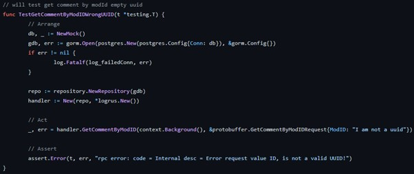
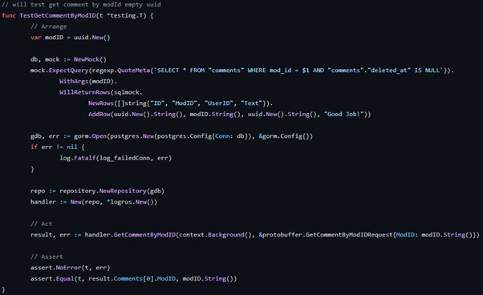
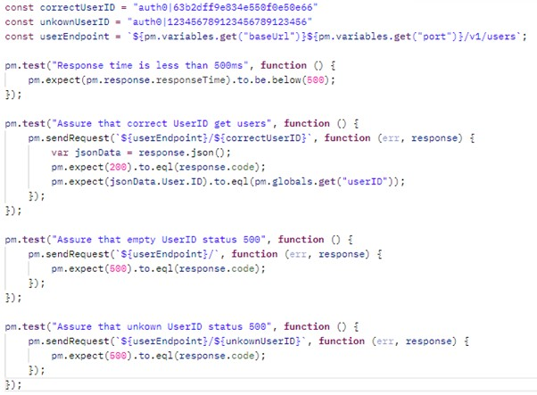
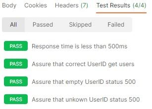

# fontys_s3_portfolio

Fontys semster 3 portfolio of the associate degree, ICT &amp; Software Engineering

-   Created By: Rik van Haaren
-   Hans van Heumen, Mark van Grootel

# Table of contents

-   [1. Introduction]()
-   [2. Learning Outcomes]()
    -   [2.1 Web application]()
    -   [2.2 Software quality]()
    -   [2.3 Agile method]()
    -   [2.4 CI/CD]()
    -   [2.5 Cultural differences and ethics]()
    -   [2.6 Requirements and design]()
    -   [2.7 Business processes]()
    -   [2.8 Professional]()
-   [3. Decision justification]()
-   [4. Individual Project (MxBikesClient)]()
-   [5. Group Project (IsItLive)]()
-   [6. Reflection]()

# 1. Introduction

**|DONE| **
Front-end, Back-end, Microservices, Docker all of these words have one thing in common, it’s used when designing and building a full stack application. With this portfolio I would like to explain how I applied all learning outcomes within my individual and group project. For the individual project I designed and build a web shop for downloading content specifically for the game MX Bikes. Within the group project we designed and build a live score metric for World of Content. With these products and this portfolio I show that I have sufficient knowledge and competences to begin with my internship within the next semester. Since the learning outcomes are the foundation for this portfolio, they will directly be discussed in the next chapter. In the following chapters, chapter three and four, the individual and group projects will be explained. Finally, within the last chapter the reflection is provided.

# 2. Learning Outcomes

This chapter provides insight within the [learning outcomes](/learningOutcomes.md#3-Agile-method). Every paragraph shortly indicates what the outcome means and explains how the specific outcome is achieved. Sometimes there is redirection for further information.

## 2.1 Web application

This learning outcome is about whether the design and build is **user-friendly** and a **full-stack** web application.

### 2.1.1 User-friendly  

**|DONE| **
_Individual project_ 
To ensure the user friendliness there a several measurements taken. First, I created a user persona based on interviews with two people that actually play the game. Based on that persona I created User Scenario's, these describe several scenarios and actions applicable to the persona. These User Scenario's are used to create user stories, which are used as a base for the design of the full stack application. Finally, there was a informal check with the interviewees. All these steps are extensively defined within [this file](./mxBikesClient_documentation/uxDocumentation.md).

_Group project_ 
In order to make sure the full stack application is user friendly, first the requirements (included in this paragraph **TODO:redirect to requirements**) were aligned with World of Content. Based on these requirements we designed a wire frame with the project group. The design was checked with World of Content. The aspect of user-friendliness is also taken into account within this check, since the retailers are the customers of World of content and are the users of the product.

2.1.2 Full-stack 
_Individual project_ 
The individual project is designed and build based on a full stack application, since I designed and build a separate back- and front-end. The front-end is developed as a single page application, with the framework React (a Javascript based framework). The back-end which is developed with multiple micro services, insight this microservice you can find multiple commonly used techniques like Object Relational Mapping. For the communication protocol I use http. To address asynchronous communication issues, several tests are executed to prevent issues from occurring. Also, the deployment environment wil restart when a process is offline and all issues will be logged.

_Group project_ 
Also, the group project is designed and build based on a full stack application. Mostly of the previous mentioned explanations are also applicable to the group project. Except that the backend is developed with NodeJS and not with microservices. You can access the frontend with this link.

## 2.2 Software quality
**|NeedsCheck| **
Voor de kwaliteit van mijn applicatie heb ik ervoor gezorgd dat ik kan verzekeren dat de applicatie op de 4 punten: “tests”, “security”, “performance” and “Static code analysis / code reviews” verantwoord is. Hieronder kun je lezen hoe ik er voor zorg deze punten dat dit ook het geval is

**Tests**: Ik voer binnen de applicatie verschillende testen uit om de kwaliteit van applicatie te kunnen garanderen en gemakkelijker foutmeldingen kan opsporen. Ik heb hieronder een aantal snippets van verschillende soorten testen staan zodat ik kan laten zien welke ik gebruik.

- Unit Test, hieronder kun je een voorbeeld zien van een unit test die de functionaliteit test van de handler “GetCommentByModID”. In deze test valideer ik dat in het verzoek wat er gestuurd wordt de input een valide uuid moet hebben die overeenkomt met het formaat. De uitslag van deze test moet een foutmelding geven dat de uuid fout is.

*Snippet of Test*  

- Integration test, hieronder bevindt zich een een voorbeeld van een integratietest. Met deze test verifieer ik dat als er een correct verzoek naar de handler “GetCommentByID” wordt gestuurd het verwachte resultaat terug komt. De test controleert of de 2 units (handler, repository) correct samenwerken. Het verwachte resultaat van deze functie is dat de gevraagde modID opgehaald wordt uit de database zonder foutmelding.

*Snippet of Test*  

- regression, met deze testen kan ik valideren dat de functionaliteiten van een de software functioneel blijven na het toevoegen van nieuwe code. Dit doe ik door in Github alle unit en integratie uit te voeren op het moment als er een wijziging plaatsvindt. Ook voer ik nieuwe testen uit in Postman waar ik de snelheid test maak ook de gehele service die een collectie heeft. Hieronder bevindt zich een snippet waar ik de ‘User’ collectie test. Het test op de snelheid maar ook of een foute of goede input de verwachten resultaat geeft.

*Snippet of Test*  

*Result*  

**Security**: My full stack application is tested on common vulnerabilities by a tool called "OWASP ZAP". This created a report based on vulnerabilities risks. I also use SonarCloud to check if there are any security vulnerabilities like connection strings or passwords in my code.

**TODO:ADD test screenshot of SQL injection**
**TODO:ADD self signed ssl**
For the back-end I knew a common vulnerability that is called "SQL injection". I solved this by using a package named "GORM" that resolves the issue by: "argument placeholders to construct the SQL statement". I also tested this with Postman to assure that it works correctly.

The front-end has a self-signed ssl certificate for establishing an encrypted link between the server and a client.

**Performance**:  voor het testen van de performance van mijn applicatie heb ik twee tools gebruikt genaam Postman en Lighthouse. 

Met Postman voer ik een test uit rechtstreeks naar de Rest-API of een gRPC server zodat ik precies kan zien hoelang het duurde voordat ik een respons heb ontvangen. Dit heb ik in een test gezet zodat ik concluderen dat de response tijd onder 200ms is.
**TODO: add screenshot**

Met Lighthouse krijg ik een rapport van hoe de SPA (Single Page Application) presteert. Dit performance rapport met de backend en de front-end en zou volgens de volgende Non-functional Requirement: “ The web app Must Have a response time under 2 seconds” gecontroleerd kunnen worden. Uit het rapport blijkt dat de pagina 0.9 seconden nodig heeft volledig interactief te zijn.
**TODO: add link lighthouse rapport**

**Static code analysis / code reviews**: hiervoor gebruik een een tool genaamd SolarCloud. Ik krijg hier in een overzicht wat de huidige kwaliteit van een repository is. In dit overzicht kan ik inzien: “Reliability”, “Maintainability”, “Security”, “Security Review” and “Duplications”. 

## 2.3 Agile method
_Individual project_
During this semester we worked based on an Agile method in both, the group- and the individual project. Since there are several methods to work with Agile, I did some research to find out which method fits best for the project. You can read more about this analysis inside [this file](./research/agile.md).

Kanban is a framework used to develop Agile. Within the individual project I choose to work with 'Kanban', because this methodology is easy to apply with a version control tool called GitHub. This allowed me to constantly sync issues to a Kanban board, in a way that the issue history still exists and are always up to date and is the same for everbody. < Working this way contributes to the principles of Agile to work with an adaptive planning, with evolutionary development, which enables early delivery and flexible responses to changes. In example, you can see one of the used sprints below.

Besides, on weekly basis there was a group discussion where we discussed the current progress with Hans van Heumen and the fellow students. Some of the feedback was converted in an issue which influenced and changed the Kanban board. In this way, also the collaborative effort and self-organizing principle are represented, and continual improvement is made possible.
 

_Group project_
For our group project we opted for the 'Scrum' Agile method. We held a stand-up every day where we met to see how the designated tasks were going. This is typical for Scrum methods. These daily stand-ups allowed us to help each other and to discuss any feedback.  Just as the individual project, we had our issue overview linked to the Kanban board in 'Github', in this way we could see the progress of each other and were able to make sure everybody was engaged. Looking at Agile, this contributes to self-organizing and cross-functional teams, where continual improvement was guiding.

What also contributed to the continual improvement was that we frequently visited the customer to make sure we were working on the right needs. In order to be flexible in responding to these changes we worked with sprints, including evolutionary development and early delivery.

## 2.4 CI/CD

**|NeedsCheck| **
Continuous Integration and Continuous Delivery is used in both of the projects (individual and group). Om dit op te stellen heb ik gebruik gemaakt van Github actions. Hierop is een trigger ingesteld die een integratie uitvoert of een deployment naar een andere omgeving. Hieronder staan de verschillende toepassingen opgesplitst in individueel en groeps project. Ook kun je naar de toepassing gaan door op de link te klikken.

**TODO:Check docker**
**TODO:Add Screenshot**
Individual:

-   CI (Continuous Integration)
    -   A push and pull request to the main branch will trigger a build that compiles the code into an executable and than it will test the code on go version '1.19'. [service comment action](https://github.com/mxbikes/mxbikesclient.service.comment/actions/workflows/go.yml)
-   CD (Continuous Delivery)
    -   A new release will trigger the tests and than publish the release on "hub.docker". [service-comment image](https://hub.docker.com/repository/docker/rikvanhaaren/service-comment/general)
    -   The go project will regularly add or update the project to pkg.go.dev. [golang package protobuf](https://pkg.go.dev/github.com/mxbikes/protobuf)

Group project:

-   CI (Continuous Integration)
    -   A push and pull request to the main branch will trigger the tests that test the application in node version: '14.x', '16.x', '18.x'. [workflows CI](https://github.com/RikVanHaaren/ah_shop_api/actions/workflows/node.js.yml)
-   CD (Continuous Delivery)
    -   A new release will trigger the tests and than publish the release on [NPM ah_shop_api](https://www.npmjs.com/package/@rikvanhaaren/ah_shop_api).

## 2.5 Cultural differences and ethics

Tijdens dit semester heb ik onderzoek gedaan naar de cultural differences and ethics. Omdat ik me nog niet bewust genoeg was van deze termen heb ik onderzoek gedaan naar wat het precies inhield. Hierdoor kwam ik in aanraking met verschillende ethische aspecten in software engineering en heb ik deze op basis van de theorie onderbouwd.

Hiernaar heb ik deze aspecten toegepast in het groepsproject hoe wij als verschillende ontwikkelaars samenwerken.

Tot slot kwam ik de ‘Code of Ethics and Professional Conduct’ waarvan ik 1 guideline heb uitgewerkt.

De onderzoeken, toepassing en guideline is zichtbaar in dit bestand.
**TODO:Etics bestand toevoegen**

## 2.6 Requirements and design

_Individual project_ 
Ik heb de non-functional requirements vertaald naar een microservice architectuur waar de logica goed verdeeld is in verschillende services en dit overlegd met de stakeholder/ Hans Heumen. Op basis van de acceptatie testen **TODO: add acceptatie testen** kan ik garanderen dat de applicatie naar behoren werkt. Ook heb ik rekening gehouden met qualiteit van de eigenschappen doordat ik “Software quality” heb uitgezocht en toegepast met verschillende testen.

De architectuur is zichtbaar in het volgende document en de eigenschappen zijn zichtbaar in dit document.

**TODO: add architectuur link** **TODO: add requirements link**

Ik heb tijdens dit project mijn non-functional requirements vertaald naar een microservice architectuur.

Hierboven bevindt zich de learning outcome 'Software quality'. Hier je meer lezen hoe ik de qualiteit van deze applicatie

_Group project_ 

## 2.7 Business processes

_Individual project_ 
I have a Business Process Modeling Notation (BPMN) about a login process in the application with the tool Studio Creatio. This process clearly displays the options of what happens if a user cannot log in and what platforms the user uses. Below you can see the result of the process.

_Group project_ 
I was responsible for the development of the albertHeijn scrapper. After the investigations I had done I found out a process that had to be followed to pick up a product. I mapped this process using flowcharts. I did this by first designing the global outcome and I zoomed in on each process as follows. The outcome of this were 3 flowcharts that I used a lot with customer communication and also towards the students. Below is the zoomed out flowchart of the process. You can see the sub processes with the following [link](./isItLive_documentation/README.md#21-Software-Component-Design).

## 2.8 Professional
_Individual project_
To show my professionality during the process I described several situations below. To start, during the individual project we held weekly group discussion meetings with other students, where we were able to help each other. In example, I helped Thisoban to develop his back-end and looked at any errors that came up. I helped Dirk with testing his application and troubleshooting in the back-end. Finally, I also discussed the developments of several functionalities with Bram and Sander, to learn from each other.

Secondly, I wrote down a weekly report on FeedPulse by answering 3 important questions: "What did I do?", "What to work on next?" and "Where do I stand?".  In this way I was able to reflect on myself and on the same time I shared my progress with others. In these feedback conversations you can also briefly read which choices I made when and why.

Another point, is the moment when I realized I had a lack of knowledge. I solved this independently by doing research and applying this in a project example. The knowledge that I gained, I shared in the group conversations in order to help classmates and possibly get other insights on the subject too.

Finally, a situation took place with my teacher, where there was a discussion about a mono repo and a multi repo in a group setting with other students. Since the discussion was only between the two of us and we didn't seem to find each other in our arguments, we ended the conversation. However, there were still some things unclear, so I decided to schedule an individual meeting where we were able to discuss further in a more appropriate setting. This ended up a good conversation with understanding, where there was enough room for both of our arguments. 

_Group project_
Within the group project there were also several situations where I improved and showed my professionality. To begin, I came up with the idea for an architecture of the application and made an example of it. I also made flowcharts, so that everyone can easily see what everything does in a visual way. Both of these, we discussed with the group for feedback and together we processed this. I also checked with everyone to make sure they understood what I meant. All the non-verbal feedback which was given and received, I processed in the peer reviews at the end of the sprints. 
 
Secondly, there was miscommunication about several mandatory functionalities. Everyone only focused on their own to do's and in the end the functionalities didn't fit well together. To solve this, I started with an inventory of all of these issues and recorded them in a clear way. After that, I translated these issues into tasks and divided them between the group members, so that we were able to move on with linking all of the functionalities together.

Finally, I spent a lot of time by helping all the group members when they needed it. This gave me also more knowledge about several topics but also on the progress of the project. Which was very helpful for the team.

# 3. Individual Project (MxBikesClient)

For my individual project I had chosen an idea that I wanted to create for a long time. It was for a game I played a lot but it had some user experience issues. In this project I solved that problem by automating steps that a user was required to take. Inside this file every chapter contains learning outcomes that I aquired from creating it.  
[View project](./mxBikesClient_documentation/README.md)

# 4. Group Project (IsItLive)

For the group project we got an asignment from [World of Content](https://worldofcontent.com/nl-nl/). They wanted us to create a live score metric on how much content can internally be found on a reatiler's website. Inside this file every chapter contains learning outcomes that I aquired from creating it.  
[View project](./isItLive_documentation/README.md)

# 4. Decision Justification

**Back-end**

-   Golang

**Front-end**

-   React
-   Tailwind

**Storage**

-   Postgres
-   Minio

-   Sonarcloud
-   Auth0
-   Docker
-   Protobuffer
-   GRPC
-   Rest

-

# 5. Reflection

To be able to correctly reflect to this project, I asked three questions to myself based on the reflection model of Gibbs:

-   Evaluation: What went well and what went wrong?
-   Analyses: What did I learn?
-   Conclusion: What could I do differently?

To begin, I struggled with the planning for this project. I put a lot of effort in helping others with their individual projects and also took the lead in the group project. In the end I had little time to finish my own individual project and needed to do lots of work in only a short period of time. So, in the future it would be smart to better set my priorities and divide my time. In this way I can also reduce my stress-level. Besides, I also noticed it wasn't very helpful for my planning that I started over for a couple of times. For example, In the beginning I had the idea to use some frameworks, which I tested and started to implement, but it seemed that there wasn't a fit with the project. So, I needed to start over with a new framework. A good lesson learned is that I should discuss my ideas with the teacher, other students, or someone with experience and knowledge, earlier and throughout in the project. They can give me advice, insights, and feedback, so I can make the right decision in an earlier stage of the project.

My next point of reflection is about the feedback conversations that I missed a few times at the end of the semester. When I missed a feedback meeting in the beginning, I directly scheduled an individual meeting for the next day. Later in the semester I had to cancel several meetings. But since I changed too much in my application, I was unable to show any new developments. I felt like I had to prove myself, get out of this on my own, and work harder towards something that did work for the project. As a result, Hans had too little insight into what I was doing and struggling with. He therefore was unable to help me. Next time, I will definitely inform the teacher better and make use of the feedback moments or schedule a conversation when I missed one, also when it means I can't really show anything. I will use it to discuss my struggles then.

Finally, the last point of reflection is about the extensive research I have conducted before and during the semester. Because I wanted to deliver a project that I really wanted to put live, I thought it was important to find all the best options out there and make it perfect. As a result, I paid less attention to the learning objectives and the assignment, which should be leading in this project. For example, I analyzed a huge number of resources about microservices and how to best use them. Also, I have watched many conferences about general issues with this architecture. Every week, I shared this information in the group discussion, where I enthusiastically shared my new insights, which I thought would perfectly fit in my project. However, this cost me so much time that progress could only be found in this. And after all, I started over, so the research was often not worth of the time spent. Nevertheless, I benefited from this since I gained more knowledge on the subject and some parts I still used in the project. But, in the end I should have focused more on the assignment itself and not on releasing the project. If I had done it this way, I probably was able to make choices sooner and hadn't had the extreme pressure within the last few weeks. This is an important lesson learned for me.

In conclusion, in my opinion I have delivered a good project in which the learning outcomes clearly emerge. My main goal was that I could manage the file (mods) on my computer with the website, and I succeeded. The quality of the application is still high. Therefore, I would reuse this set-up within future projects, because it clearly covered all the necessary point. Of course, I need to take my reflection points into account to learn from. With the knowledge I gained from both projects, the portfolio, and my learning point, am I very excited and also ready to put this in practice with the internship.
