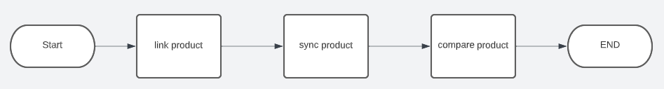

# fontys_s3_portfolio
Fontys semster 3 portfolio of the associate degree, ICT &amp; Software Engineering
- Created By: Rik van Haaren
- Hans van Heumen, Mark van Grootel

# Table of contents
- [1. Introduction]()
- [2. Learning Outcomes]()
   - [2.1 Web application]()
   - [2.2 Software quality]()
   - [2.3 Agile method]()
   - [2.4 CI/CD]()
   - [2.5 Cultural differences and ethics]()
   - [2.6 Requirements and design]()
   - [2.7 Business processes]()
   - [2.8 Professional]()
- [3. Decision justification]() 
- [4. Individual Project (MxBikesClient)]()
- [5. Group Project (IsItLive)]()
- [6. Reflection]()

#  1. Introduction
Front-end, Back-end, Microservices, Docker all of these words have one thing in common, it’s used when designing and building a full stack application. With this portfolio I would like to explain how I applied all learning outcomes within my individual and group project. For the individual project I designed and build a web shop for downloading content specifically for the game MX Bikes. Within the group project we designed and build a live score metric for World of Content. With these products and this portfolio I show that I have sufficient knowledge and competences to begin with my internship within the next semester. Since the learning outcomes are the foundation for this portfolio, they will directly be discussed in the next chapter. In the following chapters, chapter three and four, the individual and group projects will be explained. Finally, within the last chapter the reflection is provided.

# 2. Learning Outcomes
This chapter provides insight within the [learning outcomes](/learningOutcomes.md#3-Agile-method). Every paragraph shortly indicates what the outcome means and explains how the specific outcome is achieved. Sometimes there is redirection for further information.
 
## 2.1 Web application
This learning outcome is about whether the design and build is **user-friendly** and a **full-stack** web application.

### 2.1.1 User-friendly  
*Individual project* 
To ensure the user friendliness there a several measurements taken. First, I created a user persona based on interviews with two people that actually play the game. Based on that persona I created User Scenario's, these describe several scenarios and actions applicable to the persona. These User Scenario's are used to create user stories, which are used as a base for the design of the full stack application. Finally, there was a informal check with the interviewees. All these steps are extensively defined within [this file](./mxBikesClient_documentation/uxDocumentation.md).   

*Group project* 
In order to make sure the full stack application is user friendly, first the requirements (included in this paragraph **TODO:redirect to requirements**) were aligned with World of Content. Based on these requirements we designed a wire frame with the project group. The design was checked with World of Content. The aspect of user-friendliness is also taken into account within this check, since the retailers are the customers of World of content and are the users of the product.  

2.1.2 Full-stack 
*Individual project* 
The individual project is designed and build based on a full stack application, since I designed and build a separate back- and front-end. The front-end is developed as a single page application, with the framework React (a Javascript based framework). The back-end which is developed with multiple micro services, insight this microservice you can find multiple commonly used techniques like Object Relational Mapping. For the communication protocol I use http. To address asynchronous communication issues, several tests are executed to prevent issues from occurring. Also, the deployment environment wil restart when a process is offline and all issues will be logged. 

*Group project* 
Also, the group project is designed and build based on a full stack application. Mostly of the previous mentioned explanations are also applicable to the group project. Except that the backend is developed with NodeJS and not with microservices. You can access the frontend with this link.  

## 2.2 Software quality

*Individual project* 

- unit test,

- Integration Testing

- Regression Testing

- system tests

**security** My full stack application is test on common vulnerabilities by a tool call "OWASP ZAP". This created a report based on vulnerabilities risks. I also use SonarCloud to check if there are any security vulnerabilities like connections strings or password in my code.

**TODO:ADD test screenshot of SQL injection**
**TODO:ADD self signed ssl**
For the back-end I knew a common vulnerabilities that is called "SQL injection". I solved this by using a package name "GORM" this resolves the issue by: "argument placeholders to construct the SQL statement". I also tested this with postman to assure that it works correctly.

The front-end has an self-signed ssl certificate for establishing an encrypted link between the server and a client.

**performance** voor het testen van de performance van mijn applicatie heb ik twee tools gebruikt genaam Postman en Lighthouse. 

Met Postman voer ik een test uit rechtstreeks naar de Rest-API of een gRPC server zodat ik precies kan zien hoelang het duurde voordat ik een respons heb ontvangen. Dit heb ik in een test gezet zodat ik concluderen dat de response tijd onder 200ms is.
**TODO: add screenshot**

Met Lighthouse krijg ik een rapport van hoe de SPA (Single Page Application) presteert. Dit performance rapport met de backend en de front-end en zou volgens de volgende Non-functional Requirement: “ The web app Must Have a response time under 2 seconds” gecontroleerd kunnen worden. Uit het rapport blijkt dat de pagina 0.9 seconden nodig heeft volledig interactief te zijn.
**TODO: add link lighthouse rapport**

- (static code analysis / code reviews) SonarCloud 

Carry out, monitor and report on unit integration, regression and system tests, with attention for security and performance aspects, as well as applying static code analysis and code reviews.

## 2.3 Agile method
*Individual project* 
During this semester we worked based on a agile methodology. Because there are lot of methodology I was required to do some research which one was suited best for my project. You can read more about the research inside [this file](./research/agile.md).

For this project I chose 'Kanban' because this methodology is easy to apply with a version control tool called GitHub. This allowed me to link commits to a particular issue that had clearly visible values on a kanban schedule. Below you can see the the planning of a sprint.

We held a weekly group discussion where we shared our current process with Hans van Heumen and the fellow students. Some of the given feedback where converted in issue that changed in de project board.

*Group project* 
For our group project we opted for the 'scrum' agile methodology. We held a stand up every day where we met to see how the designated task assigned to him was going. This allows us to help each other well and discuss any feedback. We have a nexus in 'Github' where we could keep track of our genomes and thus see the process that other another is engaged in.

## 2.4 CI/CD
Continuous Integration and Continuous Delivery is used in both of the projects (individual and group). Om dit op te stellen heb ik gebruik gemaakt van Github actions. Hierop is een trigger ingesteld die een integratie uitvoert of een deployment naar een andere omgeving. Hieronder staan de verschillende toepassingen opgesplitst in individueel en groeps project. Ook kun je naar de toepassing gaan door op de link te klikken. 

Individual:
- CI (Continuous Integration)
    - A push and pull request to the main branch will trigger a build that compiles the code into an executable and than it will test the code on go version '1.19'. [service comment action](https://github.com/mxbikes/mxbikesclient.service.comment/actions/workflows/go.yml)
 - CD (Continuous Delivery)
    - A new release will trigger the tests and than publish the release on "hub.docker". [service-comment image](https://hub.docker.com/repository/docker/rikvanhaaren/service-comment/general)
    - The go project will regularly add or update the project to pkg.go.dev. [golang package protobuf](https://pkg.go.dev/github.com/mxbikes/protobuf)
    
Group project: 
 - CI (Continuous Integration)
    - A push and pull request to the main branch will trigger the tests that test the application in node version: '14.x', '16.x', '18.x'. [workflows CI](https://github.com/RikVanHaaren/ah_shop_api/actions/workflows/node.js.yml)
 - CD (Continuous Delivery)
    - A new release will trigger the tests and than publish the release on [NPM ah_shop_api](https://www.npmjs.com/package/@rikvanhaaren/ah_shop_api). 

## 2.5 Cultural differences and ethics
Tijdens dit semester heb ik onderzoek gedaan naar de cultural differences and ethics. Omdat ik me nog niet bewust genoeg was van deze termen heb ik onderzoek gedaan naar wat het precies inhield. Hierdoor kwam ik in aanraking met verschillende ethische aspecten in software engineering en heb ik deze op basis van de theorie onderbouwd. 

Hiernaar heb ik deze aspecten toegepast in het groepsproject hoe wij als verschillende ontwikkelaars samenwerken.

Tot slot kwam ik de ‘Code of Ethics and Professional Conduct’ waarvan ik 1 guideline heb uitgewerkt.

De onderzoeken, toepassing en guideline is zichtbaar in dit bestand.
**TODO:Etics bestand toevoegen**

## 2.6 Requirements and design
*Individual project* 
Ik heb de non-functional requirements vertaald naar een microservice architectuur waar de logica goed verdeeld is in verschillende services en dit overlegd met de stakeholder/ Hans Heumen. Op basis van de acceptatie testen **TODO: add acceptatie testen** kan ik garanderen dat de applicatie naar behoren werkt. Ook heb ik rekening gehouden met qualiteit van de eigenschappen doordat ik “Software quality” heb uitgezocht en toegepast met verschillende testen.

De architectuur is zichtbaar in het volgende document en de eigenschappen zijn zichtbaar in dit document. 

**TODO: add architectuur link** **TODO: add requirements link**

Ik heb tijdens dit project mijn non-functional requirements vertaald naar een microservice architectuur.

Hierboven bevindt zich de learning outcome 'Software quality'. Hier je meer lezen hoe ik de qualiteit van deze applicatie 

*Group project* 

## 2.7 Business processes
*Individual project* 
I have a Business Process Modeling Notation (BPMN) about a login process in the application with the tool Studio Creatio. This process clearly displays the options of what happens if a user cannot log in and what platforms the user uses. Below you can see the result of the process.

*Group project* 
I was responsible for the development of the albertHeijn scrapper. After the investigations I had done I found out a process that had to be followed to pick up a product. I mapped this process using flowcharts. I did this by first designing the global outcome and I zoomed in on each process as follows. The outcome of this were 3 flowcharts that I used a lot with customer communication and also towards the students. Below is the zoomed out flowchart of the process. You can see the sub processes with the following [link](./isItLive_documentation/README.md#21-Software-Component-Design).

## 2.8 Professional
*Individual project* 
During the individual conversation I was also involved with other students. In addition to the weekly group discussions that have been held. I helped Thisoban develop its back-end and took a look at any errors that came up. With Dirk looked at testing his application and troubleshooting in the back-end. I also occasionally asked Bram and Sander about their project where we discussed how some functionalities had been developed.

On feedpulse I wrote down the weekly report by answering 3 important questions: "What did I do?", "What to work on next?" and "Where do I stand?". This was very useful because it became so understandable to others and insightful to myself. In these feedback conversations you can briefly read which choice I made when and why.

The moment I noticed that I had a lack of knowledge, I supplemented this independently by doing research and possibly cursese. I shared this knowledge in the group conversations and also next to it with my classmates. However, this was also a pitfall because I did a lot of research during my semester and didn't make good choices in implementing the research (you can read more about this in the reflection).

*Group project* 
Ik heb de architectuur van de applicatie bedacht en hier een voorbeeld over gemaakt. Dit voorbeeld heb ik besproken met de groep en er feedback over gevraagd. Ook heb ik flowcharts gemaakt zodat je visueel makkelijker kan zien wat welk onderdeel doet. Hierdoor betrok ik de groep bij alle processen en legde ik dit op een gemakkelijke manier uit.

Later merkten ik dat we tegen een probleem aan liepen en dat was dat alle elementen bij elkaar moesten komen. Omdat iedereen zijn eigen taken op zich heeft genomen waren er een aantal miscomunicaties over bepaalde vereisten functionaliteiten. Ik heb ervoor gezorgd dat deze issues in kaart waren gebracht en goed opgeschreven werden. Als volgt heb ik deze taken verdeeld zodat we verder konden met het koppelen van de verschillende componeten.

Ik heb  tijdens dit semseter met iedereen mee gekeken en geholpen waar nodig was. Het geeft me een goede inbren over de kennis waar iemand zich bevind en hierdoor kan ik eventuelen val keulen aankaarten.

# 3. Individual Project (MxBikesClient)
For my individual project I had chosen an idea that I wanted to create for a long time. It was for a game I played a lot but it had some user experience issues. In this project I solved that problem by automating steps that a user was required to take. Inside this file every chapter contains learning outcomes that I aquired from creating it.   
[View project](./mxBikesClient_documentation/README.md)

# 4. Group Project (IsItLive)
For the group project we got an asignment from [World of Content](https://worldofcontent.com/nl-nl/). They wanted us to create a live score metric on how much content can internally be found on a reatiler's website. Inside this file every chapter contains learning outcomes that I aquired from creating it.   
[View project](./isItLive_documentation/README.md)

# 4. Decision Justification

**Back-end**
- Golang

**Front-end**
- React
- Tailwind

**Storage**
- Postgres
- Minio

- Sonarcloud
- Auth0
- Docker
- Protobuffer
- GRPC
- Rest

- 

# 5. Reflection
In order to be able to correctly reflect to this project, I asked three questions to myself based on the reflection model of Gibbs:
- Evaluation: What went well and what went wrong?
- Analyses: What did I learn? 
- Conclusion: What could I do differently? 

To begin, I struggled with the planning for this project. I put a lot of effort in helping others with their individual projects and also took the lead in the group project. In the end I had less time remaining to complete my own individual project. So, in the future it would be smart to better set my priorities and divide my time. In this way I can also reduce my stress-level. Besides, I also noticed it wasn't very helpful for my planning that I started over a couple of times. In the beginning I had the idea to use some frameworks which I tested and started to implement, but in the end there wasn't a fit with the project so I didn't want to implement further. In the future I will automatically be busy with it even more because I have now gained the experience of it and have noticed the consequences of this consequence. It is also better to discuss any possibilities earlier with the teacher or someone else who has experience so that they can give their opinion without you already doing research.

My next point of reflection is about the feedback conversations that I missed a few at the end. When I missed a feedback meeting in the beginning, I scheduled an individual meeting the next day. Later at the end of the semester I unfortunately also had to cancel a number of times and because I changed too much with my application I was unable to show any new developments. I felt like I had to get out of this myself and work harder towards something that did work for the project. As a result, Hans had less insight into what I was running into and he was therefore unable to help. Next time I will have to take this more into account. It is important for myself but also for a teacher or employer to know what you have tried to help with this. This is why I will schedule a conversation regardless of whether there is progress.

My next point of reflection is about the extensive surveys I have conducted. Because I wanted to deliver a project that I really wanted to put live, I thought it was important to find the best options here. As a result, I pay less attention to the learning objectives and the assignment. As a result, I looked at a huge amount of resources about microservices and how best to use them. Also, I've watched many conferences where they talk about general issues about this architecture. The information was offered weekly in the group discussions where I enthusiastically talked about the information that I put a lot of time into to know the ins and outs that I thought would fit perfectly in my project. However, this cost me so much time that progress could only be found in this. Also because I often started over, researching was often not worth the time spent. Nevertheless, I ultimately benefited a lot from this information and also included a lot in my project, but not everything. I should have focused more on the assignment itself and not on releasing the project. If I had done this there would automatically be less pressure to find the best way to develop it and I could make choices sooner.