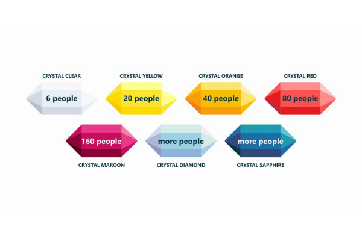

# fontys_s3_portfolio
Fontys semster 3 portfolio of the associate degree, ICT &amp; Software Engineering
- Created By: Rik van Haaren
- Hans van Heumen, Mark van Grootel

# Agile Methodology

## Table of contents
- [1. Introduction](#1-introduction)

##  1. Introduction

## 2. Agile
According to Atlassian: "Agile is an iterative approach to project management and software development that helps teams deliver value to their customers faster and with fewer headaches. Instead of betting everything on a "big bang" launch, an agile team delivers work in small, but consumable, increments. Requirements, plans, and results are evaluated continuously so teams have a natural mechanism for responding to change quickly." [[1]](#3-Source)

### 2.1 Agile manifesto
The agile manifesto exist of 12 principles and 4 principles that are listed below:
The 4 agile values are listed below,
1) **Individuals and interactions** over processes and tools
2) **Working software** over comprehensive documentation
3) **Customer collaboration** over contract negotiation
4) **Responding to change** over following a plan

 

The 12 principles are listed below,
1)	Our highest priority is to satisfy the customer through early and continuous delivery of valuable software.
2)	Welcome changing requirements, even late in development. Agile processes harness change for the customer's competitive advantage.
3)	Deliver working software frequently, from a couple of weeks to a couple of months, with a preference to the shorter timescale.
4)	Business people and developers must work together daily throughout the project.
5)	Build projects around motivated individuals. Give them the environment and support they need, and trust them to get the job done.
6)	The most efficient and effective method of conveying information to and within a development team is face-to-face conversation.
7)	Working software is the primary measure of progress.
8)	Agile processes promote sustainable development. The sponsors, developers, and users should be able to maintain a constant pace indefinitely.
9)	Continuous attention to technical excellence and good design enhances agility.
10)	Simplicity--the art of maximizing the amount of work not done--is essential.
11)	The best architectures, requirements, and designs emerge from self-organizing teams.
12)	At regular intervals, the team reflects on how to become more effective, then tunes and adjusts its behavior accordingly.

[(Manifesto for Agile Software Development, n.d.)](#3-Source)

## 3. Agile Methodologies

### 3.1 Scrum
Accourding to : "To understand the philosophy behind Scrum, it’s helpful to consider its origin. ‘Scrum’ is a rugby term that refers to a formation in which each player has a particular role. However, every member works together to achieve the same goal." [[3]](#3-Source)

**Benefits** 
1) It prescribes time-boxed iterations.
2) Cross-functional Scrum team.
3) Velocity is the default metric for process improvement and planning.
4) The scrum team faces a particular workload in an iteration.
5) Break down of items so that you can complete them in one sprint.
6) After every sprint, the board rests.
7) One can’t add new items to ongoing iterations.
8) A specific team owns the sprint backlog.
9) The product backlog is prioritized as prescribed in Scrum.

[(Tsonev, 2022)](#3-Source)

### 3.2 Kanban
> David J. Anderson (a pioneer in the field of Lean/ Kanban for knowledge work and one of the founding fathers of the method) has formulated the Kanban method as an approach to incremental, evolutionary process and systems change for knowledge work organizations. It is focused on getting things done, and its fundamentals can be broken down into two types of principles and six practices.

**Benefits** 
1) Timeboxed iteration is not compulsory.
2) Rather than being time-boxed, Kanban is event-driven.
3) There are different cadences for release, process improvement, and planning.
4) Commitment is optional.
5) Lead time is the default metric for process improvement and planning.
6) Optional cross-functional team, but teams allow specialists.
7) No particular diagram or item size is prescribed in Kanban.
8) Kanban has a natural workflow state with limited WIP.
9) Estimation is optional
10) You can always add new items whenever there’s the capacity to do that.
11) Individuals and multiples teams can share the Kanban board.
12) It doesn’t prescribe specific roles.
13) Persistency in Kanban board.
14) Prioritization is optional

**disadvantages**
1) The board has to be up-to-date because an outdated Kanban board may cause issues in the process of development.
2) Sometimes, the board can become too complicated for the Kanban team.
3) There is no timing, so the different phases don’t have timeframes attached to them.

### 3.3 Extreme Programming (XP)

### 3.4 Lean Development

### 3.5 Crystal
Crystal is considered a lightweight or agile methodology that focuses on individuals and their interactions. The methods are color-coded to significant risk to human life. It is mainly for short-term projects by a team of developers working out of a single workspace.
Two core beliefs of the Crystal method :
1) Find your own way and methods to optimize workflow.
2) Make use of unique methods to make the project unique and dynamic.

Crystel clear
1) *Crystal Clear-* The team consists of only 1-6 members that is suitable for short-term projects where members work out in a single workspace.
2) *Crystal Yellow-* It has a small team size of 7-20 members, where feedback is taken from Real Users. This variant involves automated testing which resolves bugs faster and reduces the use of too much documentation.
3) *Crystal Orange-* It has a team size of 21-40 members, where the team is split according to their functional skills. Here the project generally lasts for 1-2 years and the release is required every 3 to 4 months.
4) *Crystal Orange Web-* It has also a team size of 21-40 members were the projects that have a continually evolving code base that is being used by the public. It is also similar to Crystal Orange but here they do not deal with a single project but a series of initiatives that required programming.
5) *Crystal Red-* The software development is led by 40-80 members where the teams can be formed and divided according to requirements.
6) *Crystal Maroon-* It involves large-sized projects where the team size is 80-200 members and where methods are different and as per the requirement of the software.
7) *Crystal Diamond & Sapphire-* This variant is used in large projects where there is a potential risk to human life.

**Benefits** 
1) Allows teams to work the way they deem most effective
2) Facilitates direct team communication, transparency and accountability
3) The adaptive approach lets teams respond well to changing requirements

**disadvantages**
1) Lack of pre-defined plans can lead to scope creep
2) Lack of documentation can lead to confusion

## 3 Source
1. Atlassian. (n.d.). What is Agile? Retrieved November 3, 2022, from https://www.atlassian.com/agile
2. Manifesto for Agile Software Development. (n.d.). Retrieved November 3, 2022, from https://agilemanifesto.org/
3. Rankin, T. (2019, October 10). How to Use the Scrum Methodology to Boost Your Team’s Productivity (In 6 Steps). Torque. https://torquemag.io/2019/10/scrum-methodology-guide/
4. Tsonev, N. (2022, June 15). What Is Scrum? Everything You Need to Know. Kanbanize Blog. https://kanbanize.com/blog/scrum/
