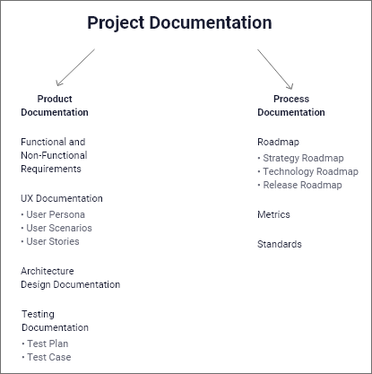

# fontys_s3_portfolio
Fontys semster 3 portfolio of the associate degree, ICT &amp; Software Engineering
- Created By: Rik van Haaren
- Hans van Heumen, Mark van Grootel

## Table of contents
- [1. Introduction](#1-introduction)

##  1. Introduction
Agile is an iterative approach to project management and software development that helps teams deliver value to their customers faster and with fewer headaches. Instead of betting everything on a "big bang" launch, an agile team delivers work in small, but consumable, increments. Requirements, plans, and results are evaluated continuously so teams have a natural mechanism for responding to change quickly.

## 2. Principles behind the agile manifesto
1)	Our highest priority is to satisfy the customer through early and continuous delivery of valuable software.
2)	Welcome changing requirements, even late in development. Agile processes harness change for the customer's competitive advantage.
3)	Deliver working software frequently, from a couple of weeks to a couple of months, with a preference to the shorter timescale.
4)	Business people and developers must work together daily throughout the project.
5)	Build projects around motivated individuals. Give them the environment and support they need, and trust them to get the job done.
6)	The most efficient and effective method of conveying information to and within a development team is face-to-face conversation.
7)	Working software is the primary measure of progress.
8)	Agile processes promote sustainable development. The sponsors, developers, and users should be able to maintain a constant pace indefinitely.
9)	Continuous attention to technical excellence and good design enhances agility.
10)	Simplicity--the art of maximizing the amount of work not done--is essential.
11)	The best architectures, requirements, and designs emerge from self-organizing teams.
12)	At regular intervals, the team reflects on how to become more effective, then tunes and adjusts its behavior accordingly.

## 3. Life Cycle
The Agile software development life cycle is the structured series of stages that a product goes through as it moves from beginning to end. It contains six phases: concept, inception, iteration, release, maintenance, and retirement.

## 4. Software planning and technical documentation
Software planning is in many ways synonymous with software documentation, this is because technical documentation is where the software starts taking it shape. It’s where the idea of an application becomes a complex system with its business logic, text specifications and user flows and where we first determine the path to this transformation.     
Ultimately the documentation help us answer two big question:
1)	The first question will be: “What should the product be like?”, this part of project management is described in product documentation.
2)	The second question is: “How are we going to build it?”, this will be covered in the process documentation.

