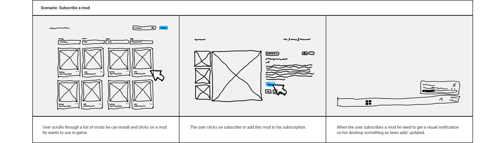

# UX Documentation

## 1. User Persona

**About**: 
Our persona will be a 30 year old man who is just getting started with MX Bikes. He isn't familiar with the community mods and asking him self why don't I have that track I just saw online.

**Age**: 30

**Hometown**: The Netherlands

**Family**: Single

**Occupation**: New to the game en getting to know it.

**Pain Points**: Time it takes to find good mods and to install them. The don't like to get redirected to all the third parties websites. Wants a safe and secure way that doesn't offend it.

**Goals**: Play the game without any effort on getting to know the processes. A fast process that can easily been managed.

### 1.1 Interview
Interview Questions
**What is the purpose?**
I want to improve the MX Bikes mod installation process. I want to this by creating an easy visual overview of mods that are on our platform where you can search and filter by your needs.  When the user found the mods he wants to use the mods needs to install automatically to the client and keep up to date.

**The goals?**
With this improvement I want to raise the popularity of the game and make sure that the new users have a simple experience. I also want to improve the visualization of mods with product similarity.

**Technical**
- What technology you use?
- What software/ websites do you use?
- How much time do you spend browsing?

**Motivations**
- What motivates you on the game?
- What do you think the community needs?
- What do you want to do?
- What are your needs?

 

### 1.2 Interview Answers
*User 1:*

**Technical**
- What technology you use?
    - I most often use my pc as technology but I also make use of my cell phone and tv 
- What software/ websites do you use?
    - I use windows 10 on my pc on that pc I also use steam for the downloads and ds4 for connecting my controller because I prefer playing on controller and brave to look al the thing up to play the game but also to download maps and that kind of stuff
- How much time do you spend browsing?
    - I don’t browse very often because I have a lot of ppl around me that can give me advice on what to choose or where to look for things

**Motivations**
- What motivates you about the game?
    - I think it’s a fun game It is a fun game to play with friends it is really realistic and you can really play it if you invest time into it because it is not for every player it also has a nice community  
- What do you think the community needs?
    - I don’t know for sure I never really invested my time to look wat is in the community but I think if the community keep making new maps and stuff the are on the right way
- What do you want to do?
    - I think as community give the best advice on how you can improve the mods and deliver the mods to you because not every mod is a good mod in terms of mx bikes

- What are your needs?
    - I am already a pro in the game so for me not so much but for other ppl a clear tutorial made by the community because the know how you can learn it the best way and the most logical way 

*User 2:*

**Technical**
- What technology you use?
    - Game PC  / Windows 11 pro
- What software/ websites do you use?
    - MXB-Mods / Forum.mx-bikes / Winzip/ You tube
- How much time do you spend browsing?
    - About 8 Hours a week

**Motivations**
- What motivates you on the game?
    - It's a technical and Challenging
- What do you think the community needs?
    - A simple way to customize the game
- What do you want to do?
    - Make Bikes/Drivers nicer and better
- What are your needs?
    - An easy way to make changes and updates to the game

## 2. User Scenarios
The user scenarios are based on the persona created above. The scenarios describes a realistic situations relevent to the design of a solution.

## 3. User Stories
These user stories are written in the view of a persona, the differ between a user (inspirited by the persona created above) and a administrator.
- As a User I want to see all products on a page so that I can pick one I Like.
- As a User I want to select a product so that I can see more context of it.
- As a User I want give a product a star based valuation so that other users can see how much I liked it.
- As a User I want to give a product a heart so that I can se the product I liked.
- As a User I want to subscibe to a product so that it can automatic or manual download.
- As a Administrator I want manage products so that I can edit, remove and create them.
- As a Administrator I want analyse products so that I can see how much and when a product has been watched, subscribed and liked.
- As a Administrator I want change a account rights so that I can make it an admin too.
