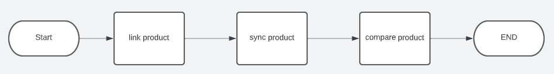
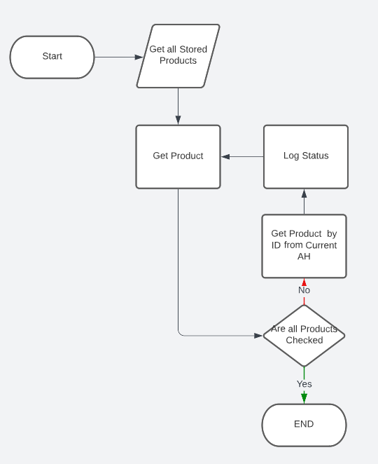
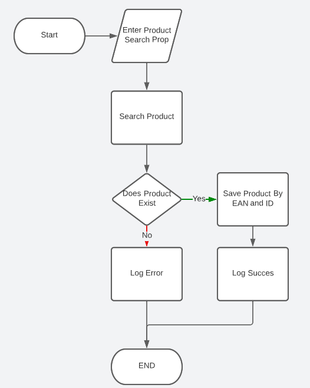
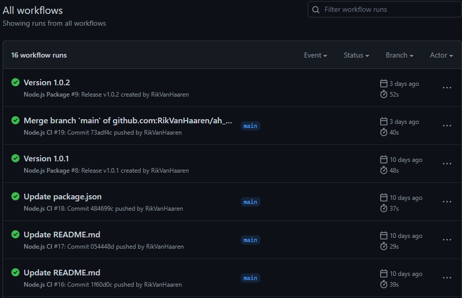

# Is It Live
> Inside this directory you can find the documentation needed for the realisation of this project.

For our group project we where ask to solve a problem from [World of Content](https://worldofcontent.com/nl-nl/). The assignment was as followed:
Live score is a metric to see how much content we have realized internally can be found on a retailer's website. Example: three attributes are shared with the Albert Heijn (Title, Brand and Description). AlbertHeijn has only put the Title and Brand online, the live score could then be 66%.

## Table of contents
- [1. Introduction](#1-introduction)
- [2. Albertheijn Scrapper](#2-Albertheijn-Scrapper)
  - [2.1 Software/ Component Design](#21-Software-Component-Design)
  - [2.2 Software Quality](#22-Software-Quality)
  - [2.3 CI/CD](#23-CICD)

##  1. Introduction
This document is used as a guide for the directory. In the chapters below you can see what the content is of each file and what learning goal I acquired. You can see the document with all the information if you click on a link below the description.

## 2. Albertheijn Scrapper
One of my task was to create a scrappers that gets the product from AlbertHeijn webshop. Is is importend to document these steps because the team needs to use in the main application.   
[View project](https://github.com/RikVanHaaren/ah_shop_api)

### 2.1 Software/ Component Design
> Learning outcome: [Requirements and design](/learningOutcomes.md#6-Requirements-and-design)

This scrapper is installed as an package but is used inside the project as process. Because I tested en created this process I needed a way to explain it easy to the colleagues.

 

### 2.2 Software Quality
> Learning outcome: [Software quality](/learningOutcomes.md#4-Software-quality)

To assure good software quality and performance for this scrapper, I have written a number of tests. When I run these test it will result me in a test how much of the code is coverd and how much of these test failed or pass. With this feature I can solve problems faster and assure our them that I have tested what I created.

### 2.3 CI/CD
> Learning outcome: [CI/CD](/learningOutcomes.md#4-CI-CD)

Continuous Integration and Continuous Delivery is an importend aspect of this project because this scrapper is a component. There for I have created 2 workflows:
-  Continuous Integration- when a some pushes code on main it will test the code on 3 different node versions.
-  Continuous Delivery- when a new release has been created the code will be tested on 3 different node versions and if succesfull the code will be published on NPM.

