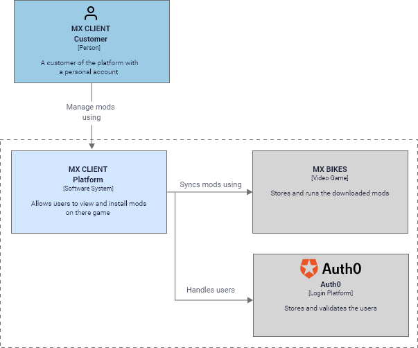
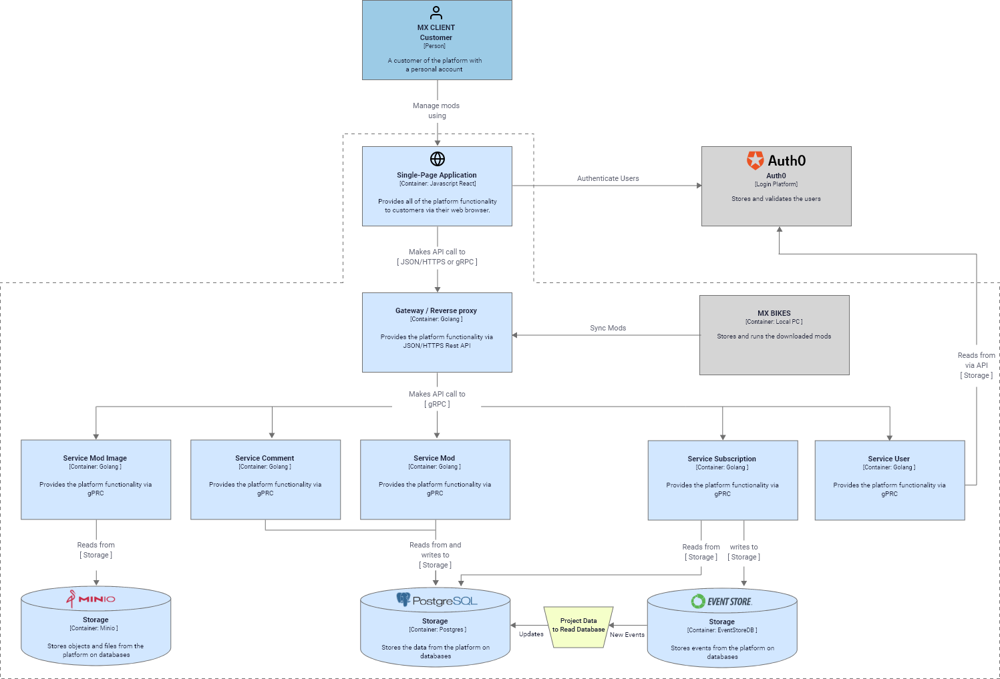

# Architecture Design
##  1. C4 model

### 1.1 Context
Below you can see the System Context Diagram of the software.

### 1.2 Container
Below you can see a deeper view on what containers the application contains.

