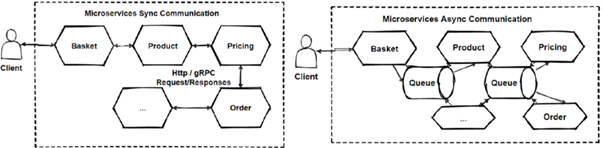

Rik van Haaren   
Hans van Heumen   
Individual project   
18 Oktober 2022   
 

Asynchronous message-based communication

<b>Introduction</b>

Synchronous communication is good if your communication is only between a few microservices. But when it comes to several microservices need to call each other and wait some long operations until finished, then we should use async communication. Otherwise that dependency and coupling of microservices will create bottleneck and create serious problems of the architecture.
	
 
We should understand that isolation is important between microservices, we should isolate services as much as possible. Since microservices are distributed system running on multiple processes, services required to interact with each other with using an inter-process communication protocols like sync HTTP, gRPC or async AMQP protocols.
If we have a few interaction with querying microservices then we should use HTTP request/response with resource APIs. But when it comes to busy interactions in communication across multiple microservices, then we should use asynchronous messaging platforms like message broker systems.
We said Asynchronous protocols, which is AMQP protocol for performing async message transmissions. In this AMQP protocol, the producer send a message and doesn’t wait a response. It only send message and expects that it will consume by subscriber services via to message broker systems.

Works Cited
https://medium.com/design-microservices-architecture-with-patterns/microservices-asynchronous-message-based-communication-6643bee06123
