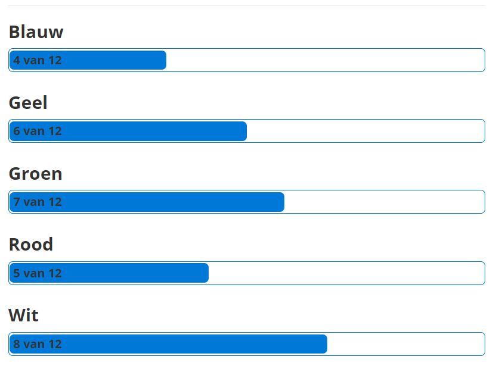
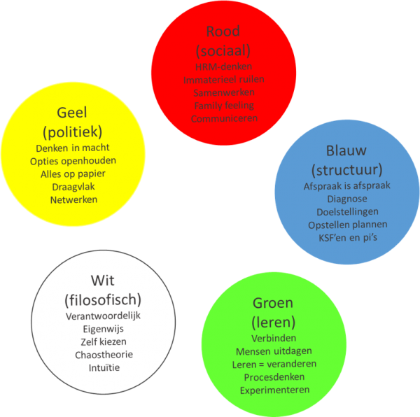

# Kleurentest van De Caluwé
what?
We zouden een workshop krijg over deze leeruitkomst helaas ging deze niet door vanwege omstandigheden. voor deze workshop werd iedereen gevraagd om 2 testen te doen waarbij de ene test ging over de Kleurentest van De Caluwé en de andere ging over teamrollen.

Voordat ik de Kleurentest van De Caluwé ging maken heb ik eerst even doorgelezen wat deze test inhoud. Het doel van deze kleurentest is mijn inzicht te versterken in de wijze waarop je denkt en handelt in een veranderproces. Uit deze test komt naar voren waar mijn relatieve voorkeuren liggen op basis van de 5 kleuren met daarin in de veranderkundige groepen. Er komt ook uit naar voren in welke mate ik denk en doen met elkaar in overeenstemming zijn.

Nadat ik de test heb afgelegd ben ik gaan kijken naar de kleur die het hoogste was en naar de kleur die het laagste was. De kleur wit kwam bij mij het sterkst naar voren: verantwoordelijk, eigenwijs, zelf kiezen, chaostheorie en intuïtie. En de kleur blauw was het laagst: afspraak is afspraak, diagnose, doelstellingen, opstellen plannen en KSF’en pi’s.

Ik vind het heel erg interessant hoe naar mijn mening deze score overeenkomt met mijn persoonlijke mening. Je kunt hier specifieke punten waar ik goed in was en minder goed terug lezen in de reflectie en hier zag ik punten die overeenkomen.

so what?
Kleurentest van De Caluwé staat in het teken voor zelf verbetering, als je lager op een kleur scoort dan kun je er bewust over nadenken en bij stilstaan hoe dit kun verbeteren. Hierdoor kun je er voor zorgen dat je eventuele problemen die je binnen een groep kunt delen zodat andere hier rekening mee kunnen houden of je kunt er zelf mee aan de slag gaan. Tenzij dat je tevreden bent met de uitslag dan kun je hoef je hier niks te veranderen.

now what?
Omdat uit deze blauw het minst sterk naar voren is gekomen en ik dat ik het ook kan terug zien in de reflectie. Hierom heb ik een aantal punten uit deze kleur opgeschreven wat ik hier aan kan verbeteren. Een van deze punten is bijvoorbeeld plannen. In de reflectie vertel ik dat ik veel bezig was met het helpen van andere en dat mijn focus te veel op het groeps project lag. In de reflectie schrijf ik dat ik beter mijn prioriteiten moet verdelen samen met mijn tijd. 

Bronnen:
https://commendatio.nl/test/kleurentest-caluwe/#:~:text=Doel%20Kleurentest&text=Uit%20deze%20test%20komt%20naar,met%20elkaar%20in%20overeenstemming%20zijn.

https://boomstrategie.nl/model/veranderen-met-het-kleurenmodel-van-de-caluwe-vermaak
