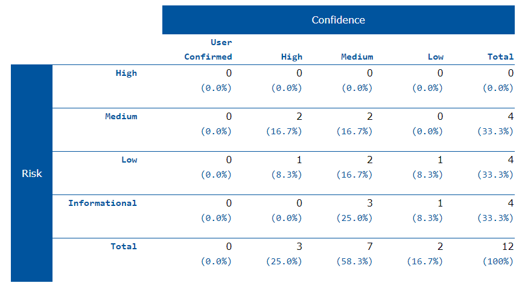

# Security testing with Zaproxy

I tested my web application with a security tool called Zaproxy. 

- **Vulnerability Assessment** – The system is scanned and analyzed for security issues.
- **Penetration Testing** – The system undergoes analysis and attack from simulated malicious attackers.
- **Runtime Testing** – The system undergoes analysis and security testing from an end-user.
- **Code Review** – The system code undergoes a detailed review and analysis looking specifically for security vulnerabilities.

I executed an "Automated Scan" this wil test the most common Penetration testing  

When the "Automated Scan" is finished with all testing each 
After I scanned the test on my full stack application vulnerability 

[HTML link](../utils/zapLogs/2023-01-05-ZAP-Report-.html)